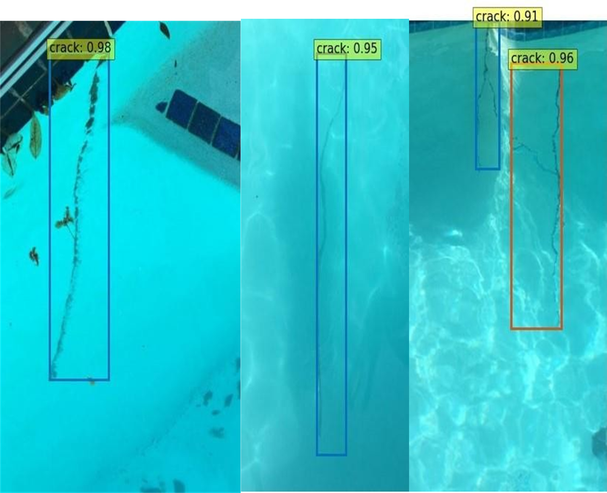

# BB-UWCrack
This repository contains the dataset and model weights for the paper "BB-UWCrack: A Benchmark Dataset for Bounding Box Crack Detection in Underwater Structures," submitted to the Advances in Science & Engineering Technology (ASET) Conference 2025.

Underwater structures are essential for the exploration and exploitation of offshore Oil\&Gas. The damage to such structures can result in environmental contamination, explosions, and financial loss. Therefore, it is crucial to use intelligent inspection technologies to guarantee the integrity of underwater structures. While deep learning is inherently data-driven, there is a notable shortage of publicly available datasets for Bounding Box Underwater Crack Detection (BB-UWCD). This study introduces a benchmark BB-UWCD dataset comprising 5,926 manually annotated images: 5,876 synthetic images featuring underwater noise generated via Generative Adversarial Networks (GANs), and 50 real-world images collected through remotely operated vehicles and online sources. Eight state-of-the-art object detection models, including You-Only-Look-Once (YOLO) Model variants, Real Time DEtection TRansformer (RT-DETR), RetinaNet, and Region-based Convolutional Neural Networks (R-CNNs), were trained and evaluated on this dataset to establish baseline performance benchmarks.

## The Dataset
- [Dataset](https://drive.google.com/drive/folders/1TsYDMr0pHJNyavnBpQFxAUCwOJlVG2L1?usp=sharing)
- [Model Weights](https://drive.google.com/drive/folders/1O-ZkBD54nzkZM4Jb6nNjvJBT_47r5pVb)
  

